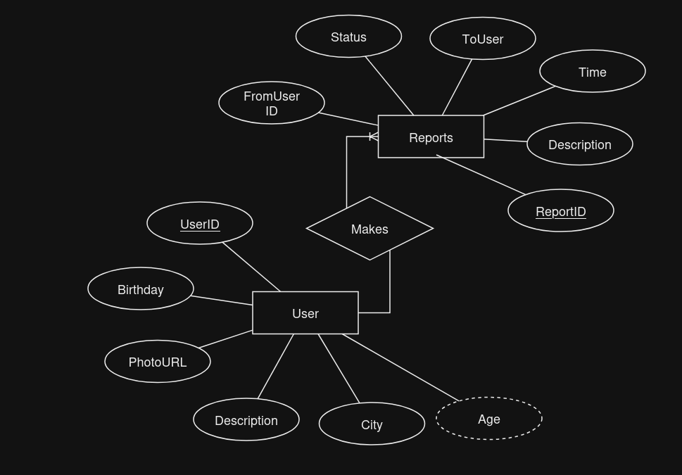
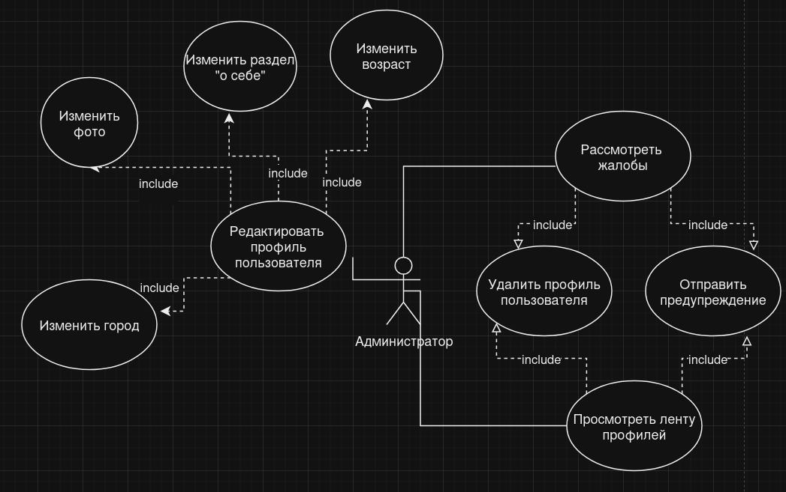
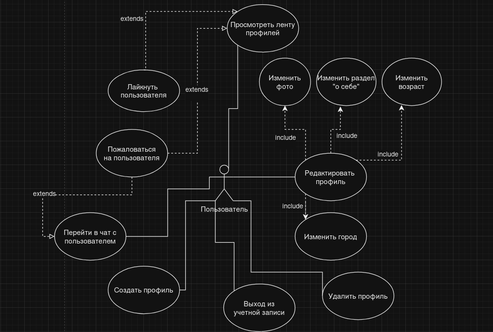
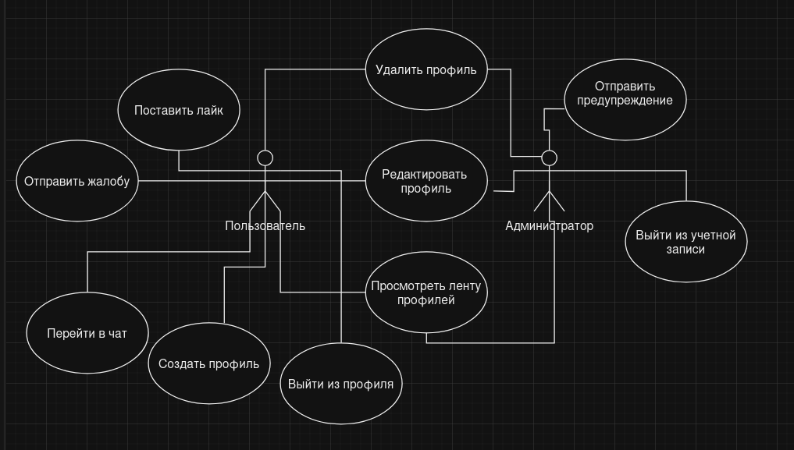

# ISLAMEET

Современное приложение для знакомств с упором на мусульманскую аудиторию

# Стек технологий:
  Python FastAPI
  - Database: SQLAlchemy (В данный момент используется SQLite, но благодаря ORM нетрудно в будущем поменять на PostreSQL)
  - Auth: FastAPI Auth
  - Users: FastAPI Users

# ER-диаграмма



# Роли пользователей




# API Сервера:
app/main.py

# Текущее дерево проекта (Oct 27, 2024)
```
.
├── alembic
│   ├── env.py
│   ├── README
│   ├── script.py.mako
│   └── versions
│       └── c73ef81c1676_init.py
├── alembic.ini
├── app
│   ├── main.py
│   ├── models
│   │   └── user.py
│   ├── repositories
│   │   └── user_repository.py
│   ├── routers
│   │   └── user_router.py
│   ├── schemas
│   │   └── user.py
│   └── services
│       └── user_service.py
└── db
    └── database.py
```